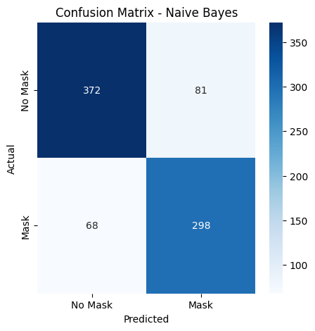
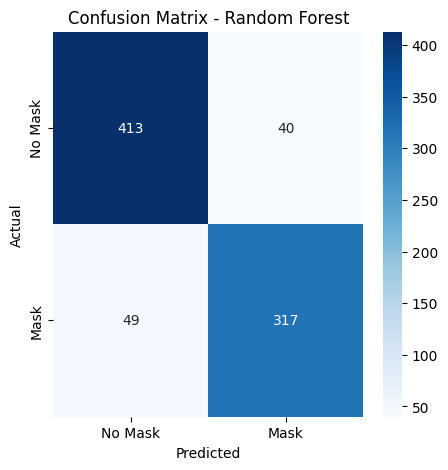
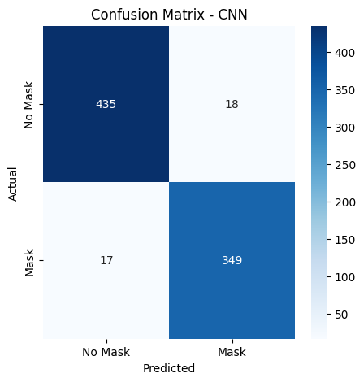
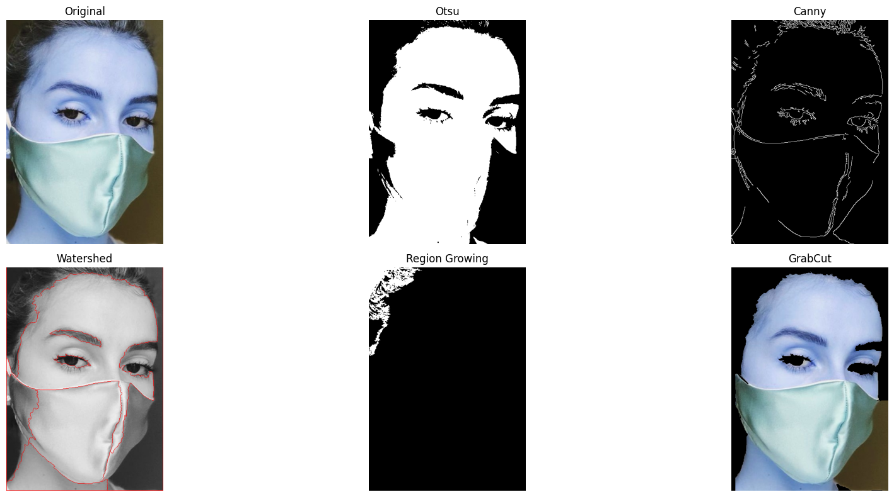
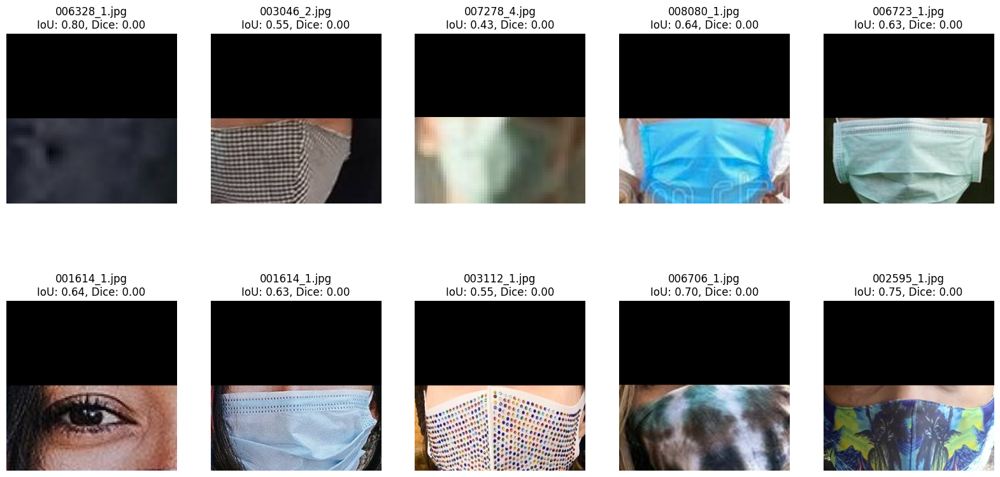
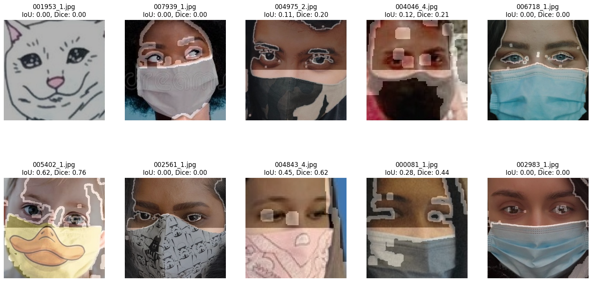
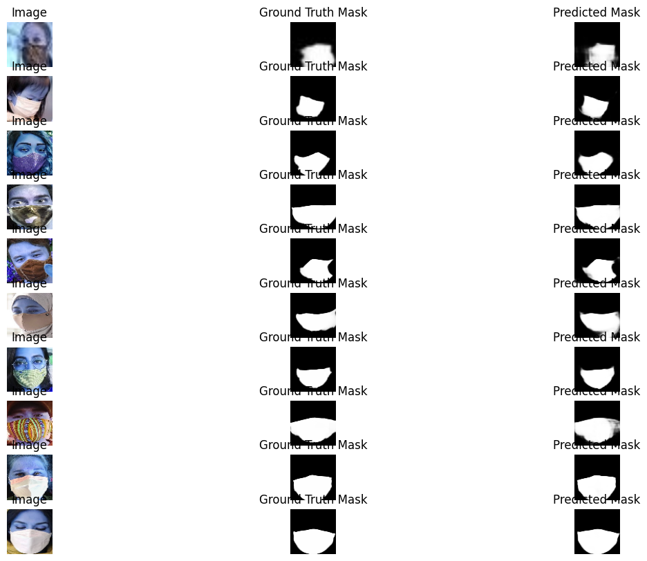

# TASK1 : Face Mask Classification 

## 1. Introduction

This project focuses on the task of **face mask classification**, where images are classified as "with mask" or "without mask" using traditional machine learning approaches. The objective is to compare handcrafted feature extraction techniques to determine the most effective method for classification.

## 2. Dataset

The dataset used for this project is sourced from [GitHub](https://github.com/chandrikadeb7/Face-Mask-Detection/tree/master/dataset). It consists of two folders:

- **with_mask**: Contains images of individuals wearing masks.
- **without_mask**: Contains images of individuals without masks.

The dataset is pre-labeled, and images are preprocessed before feature extraction and classification.

## 3. Methodology

### **Handcrafted Feature Extraction Methods**

To enhance the performance of classical machine learning models, several feature extraction methods were implemented:

- **Histogram of Oriented Gradients (HOG)**: Captures gradient-based features, particularly useful for structured objects like masks. Different cell and block sizes were experimented with to optimize feature extraction.
- **Local Binary Patterns (LBP)**: Extracts micro-texture patterns, aiding in distinguishing mask textures from facial features. Multi-scale LBP was applied for robustness.
- **Gabor Filters**: Utilized to capture edge and texture information across multiple orientations and scales, improving recognition of different mask patterns.
- **Color Histograms**: Used in RGB and HSV color spaces to capture color-based differences in masked and unmasked regions.
- **Scale-Invariant Feature Transform (SIFT)**: Extracted key points and descriptors that remain stable under transformations, helping in feature-based classification.

### **Classification Models**

The extracted features were fed into different classifiers to evaluate performance:

- **Support Vector Machine (SVM)**: Implemented with linear and radial basis function (RBF) kernels for optimal decision boundary learning.
- **Random Forest (RF)**: An ensemble learning approach that helps improve generalization.
- **Naïve Bayes (NB)**: Used as a probabilistic model to provide a baseline comparison.

## 4. Results

The following table summarizes the performance of different machine learning models:

| Model         | Features     | Accuracy |
| ------------- | ------------ | -------- |
| SVM           | HOG          | 88.52%   |
| Random Forest | Combined+PCA | 89%      |
| Naïve Bayes   | Combined+PCA | 85%      |

## 5. How to Run the Code

### **Required Files**

- **Dataset**: Download from [GitHub](https://github.com/chandrikadeb7/Face-Mask-Detection/tree/master/dataset).
* **Combined Features file**: The combined_features.pkl file is publicly available at [Drive](https://drive.google.com/file/d/1JHdbQ22umFFFw53znXDliCWjK-f8S1Tt/view?usp=drive_link)  . 

## 6. Conclusion

This project successfully implemented traditional machine learning approaches for face mask classification. Key takeaways:

- **HOG + SVM performed best** among single feature handcrafted models.
- **Random Forest + Combined Features + PCA** performed best among combined features
- **Feature extraction using handcrafted features was significantly helpful and capable for the classification task**.

# Task 2 : Face Mask Detection: CNN-Based Classification Report

## 1. Introduction

This project focuses on the task of **face mask classification** using **Convolutional Neural Networks (CNNs)**. The objective is to develop a deep learning model capable of classifying images as "with mask" or "without mask" using CNN architectures and evaluate their effectiveness.

## 2. Dataset

Same as previous task.
## 3. Methodology

### **Data Preprocessing**

- **Image Resizing**: All images were resized to **128x128 pixels** for consistency.
- **Normalization**: Pixel values were normalized to the range [0,1] to improve convergence.
### **CNN Architectures**

#### **CNN Version 1 (Baseline Model)**

- **Conv2D (32 filters, 3x3 kernel)**
- **MaxPooling2D (2x2 pool size)**
- **Conv2D (64 filters, 3x3 kernel)**
- **MaxPooling2D (2x2 pool size)**
- **Conv2D (128 filters, 3x3 kernel)**
- **Flatten & Dense Layers(128 Neurons)**
- **Dropout (0.5) for regularization**
- **Output Layer: Dense(1, activation='sigmoid')**

#### **CNN Version 2 (Deeper Network)**

- **Added fourth Conv2D layer (256 filters, 3x3 kernel)**
- **Added another Dense Layer(128 Neurons) and another Dropout Layer(0.6)**

### **Training & Optimization**

- **Loss Function**: Binary Cross-Entropy
- **Optimizers Tested**: Adam, SGD
- **Batch Size**: 32
- **Epochs**: 100 per variation (for baseline CNN), 50 per variation for CNN_V2
- **Validation Split**: 20% of training data

## 4. Hyperparameters and Experiments

Multiple variations of the CNN models were trained by changing hyperparameters. The key configurations tested were:

| Model Variation | Optimizer | Activation | Accuracy   | Epochs |
| --------------- | --------- | ---------- | ---------- | ------ |
| CNN V1          | Adam      | ReLU       | 96.34%     | 100    |
| CNN V1          | SGD       | ReLU       | **96.70%** | 100    |
| CNN V1          | Adam      | Tanh       | 88.64%     | 100    |
| CNN V1          | SGD       | Tanh       | 95.73%     | 100    |
|                 |           |            |            |        |
| CNN V2          | Adam      | ReLU       | 96.95%     | 50     |
| CNN V2          | SGD       | ReLU       | 97.19%     | 50     |
| CNN V2          | Adam      | Tanh       | 84.37%     | 50     |
| CNN V2          | SGD       | Tanh       | **97.31%** | 50     |
|                 |           |            |            |        |

## 5. Results 

#### **Key Observations**

1. **Impact of Optimizer**:
    
    - The **SGD optimizer** consistently performed better than Adam in most cases.
    - The best accuracy (**97.31%**) was achieved using **CNN V2 with SGD and Tanh activation**.
    - Adam performed well with ReLU but struggled with Tanh, indicating it might be more sensitive to activation functions.
    
2. **Impact of Activation Function**:
    
    - **ReLU outperformed Tanh in most cases**, suggesting that it is a more effective activation function for CNN-based image classification.        
    - The **lowest accuracy (84.37%)** was observed with **CNN V2 using Adam and Tanh**, highlighting that this combination was suboptimal.
        
3. **Comparison Between CNN V1 and CNN V2**:
    
    - **CNN V2 achieved higher accuracy compared to CNN V1 in all cases.**
    - CNN V2 models required **fewer epochs (50)** to reach superior performance, whereas CNN V1 models were trained for **100 epochs**. This suggests that CNN V2 has a more efficient architecture.
        
4. **Best Performing Model**:
    
    - The **CNN V2 model with SGD and Tanh achieved the highest accuracy (97.31%)** in just 50 epochs.
    - The second-best performing model was **CNN V2 with SGD and ReLU (97.19%)**.

# Task 3: Image Segmentation using Traditional Methods

## i. Introduction

This project evaluates the effectiveness of different image segmentation techniques by comparing their Intersection over Union (IoU) scores. The primary objectives are:

- Implementing multiple segmentation algorithms.
- Assessing their accuracy using IoU as the key metric.
- Identifying the best-performing method for the given dataset.

## ii. Dataset

The dataset consists of facial images and corresponding segmentation masks. The dataset is structured as follows:

- **Image folder:** `/content/drive/MyDrive/1/face_crop`
- **Mask folder:** `/content/drive/MyDrive/1/face_crop_segmentation` Each image has an associated mask highlighting specific regions of interest.

## iii. Methodology

### 1. Image Preprocessing

- Images were loaded using OpenCV and resized where necessary.
- Converted images to grayscale for threshold-based methods.
- Applied various segmentation techniques to extract key regions.

### 2. Segmentation Techniques and IoU Scores

The following segmentation techniques were implemented and evaluated:

| Segmentation Method              |
| -------------------------------- |
| **Otsu's Thresholding**          |
| **Canny Edge Detection**         |
| **Watershed Algorithm**          |
| **Region Growing**               |
| **GrabCut Algorithm**            |
| **Haar Feature-Based Detection** |

### Description of Techniques:

- **Otsu's Thresholding**: Automatically determines a global threshold to separate foreground and background.
- **Canny Edge Detection**: Identifies edges using gradient-based filtering, useful for object boundaries.
- **Watershed Algorithm**: A marker-based segmentation technique that segments an image into regions based on gradients.
- **Region Growing**: Starts from seed points and expands by adding neighboring pixels with similar properties.
- **GrabCut Algorithm**: A graph-based segmentation technique that refines segmentation iteratively.
- **Haar Feature-Based Detection**: Utilizes Haar-like features for object detection, often used in facial detection and segmentation tasks.
## 3. Results

- The **GrabCut Algorithm** gave the best visually sensible results.
- **Haar Feature-Based Detection achieved an IoU of 0.69**, demonstrating a reasonable capability for segmentation.
- **Otsu's Thresholding and Canny Edge Detection** had lower IoU scores, indicating less accurate segmentations.
- The **Haar Feature Based Segmentation** gave the best results as we accurately detecting eyes and assuming that the portion below them should be a mask.
- **Region based segmentation on Haar results** performed poorly giving an **IoU of 0.18**.

## 4. Observations and Analysis

- **GrabCut outperformed other methods** due to its ability to refine boundaries through iterative graph-based optimization.
- **Region Growing was effective but sensitive to seed point selection**, requiring careful initialization.
- **Otsu's Thresholding and Canny Edge Detection** struggled due to lack of contextual awareness, leading to fragmented segmentation.
- **Watershed worked well but sometimes over-segmented regions**, reducing overall accuracy.
- **Haar Feature-Based Detection performed reasonably well but had limitations when segmenting complex regions.**

# Task 4: U-Net Model for Image Segmentation

## i. Introduction

This report presents an analysis of a U-Net model designed for image segmentation. The objective of this study is to evaluate the model's architecture, hyperparameters, and performance metrics, focusing on Intersection over Union (IoU) as the key evaluation metric.

## ii. Dataset

Same as previous task.

## iii. Methodology

### 1. Data Preprocessing

- Images were resized to a uniform dimension.
- Pixel values were normalized between 0 and 1.
### 2. U-Net Model Architecture

U-Net is a widely used convolutional neural network for image segmentation. It consists of an encoder-decoder structure:

#### **U-Net Architecture**

- **Encoder:** Uses convolutional layers followed by max-pooling to extract spatial features.
- **Bottleneck Layer:** Bridges the encoder and decoder while preserving essential features.
- **Decoder:** Uses upsampling layers to restore spatial dimensions and refine segmentation.
- **Skip Connections:** Directly transfer spatial information from the encoder to the decoder to improve segmentation accuracy.
- **Output Layer:** Uses a sigmoid activation function to generate a pixel-wise segmentation mask.

### 3. Hyperparameters

- **Batch Size:** 16
- **Optimizer:** Adam
- **Learning Rate:** 0.0001 applied reducing learning rate
- **Loss Function:** Binary Crossentropy
- **Epochs:** 50-100 depending on the experiment

## iv. Results

The U-Net model was evaluated based on the Intersection over Union (IoU) score:

| Model Variation | Optimizer | IoU Score  | DICE Coeff. | Epochs |
| --------------- | --------- | ---------- | ----------- | ------ |
| U-Net           | Adam      | **0.8764** | **0.9339**  | 50     |

## v. Observations and Analysis

- Implemented on Kaggle to use **Dual GPUs for faster training**.
- 
- **Architecture Comparison:** U-Net achieved superior performance than traditional methods due to improved layer configurations and skip connections.
- **IoU Score Trends:** The highest IoU score of **0.87** indicates an effective segmentation performance.

